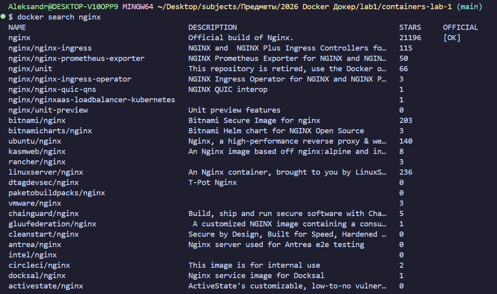
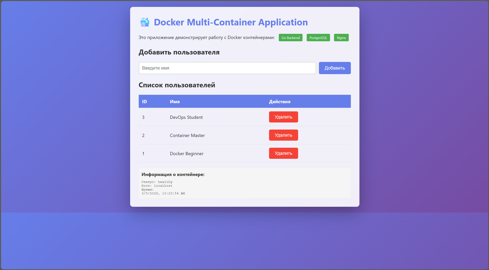
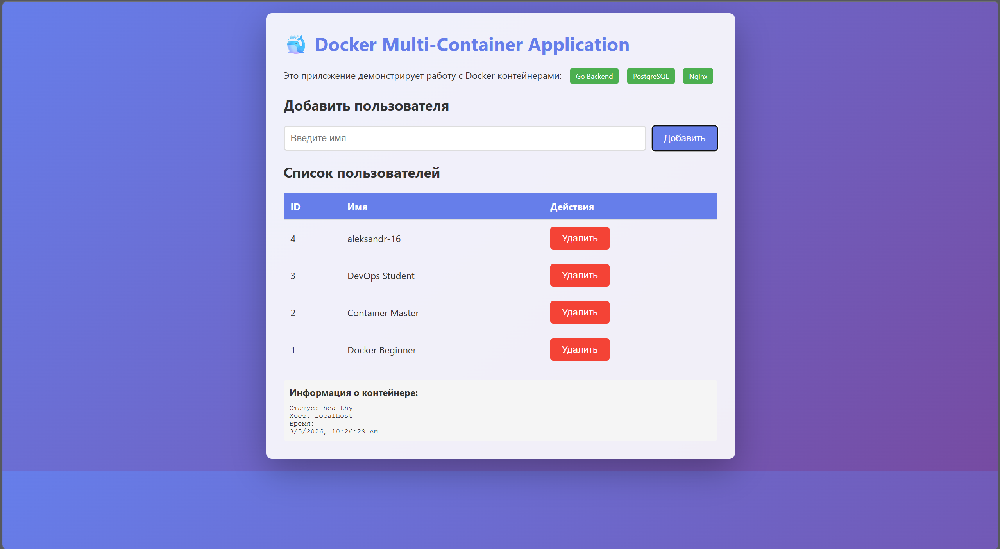
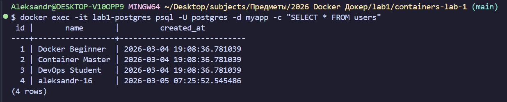
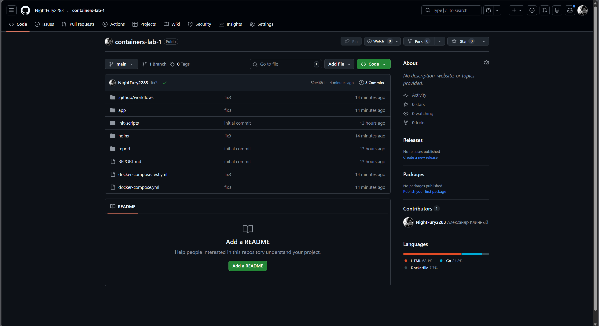
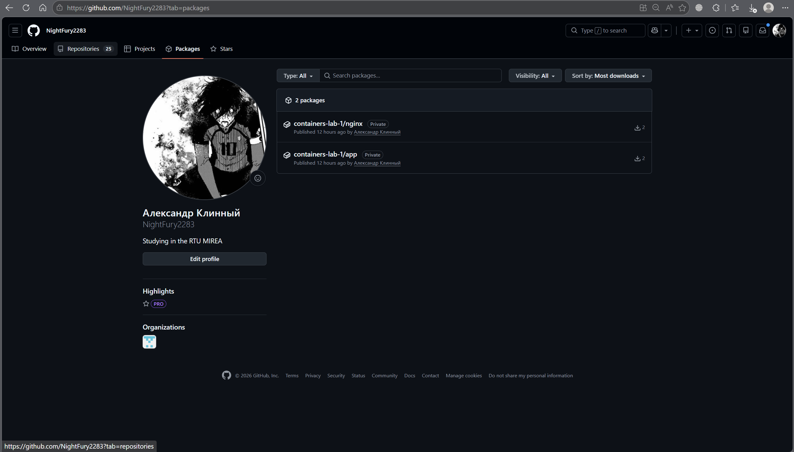

# Отчет по практической работе №1
## Студент: KAI
## Группа: 16
## Дата выполнения: 04.03.2026

### 1. Выполненные команды Docker

#### 1.1 Работа с образами
Поиск образов в Docker Hub
docker search nginx

Скачивание образа
docker pull nginx:alpine

Просмотр локальных образов
docker images

Просмотр истории слоев образа
docker history nginx:alpine

Удаление образа
docker rmi nginx:alpine

##### Практическое задание: скачивание PostgreSQL 15 и Go 1.21

#### 1.2 Работа с контейнерами
Запуск контейнера alpine в интерактивном режиме
docker run -it --name test-alpine alpine:latest sh

Внутри контейнера: ls -la, exit

Запуск контейнера в фоновом режиме
docker run -d --name web-server -p 8080:80 nginx:alpine

Просмотр запущенных контейнеров
docker ps

Просмотр всех контейнеров (включая остановленные)
docker ps -a

Просмотр логов контейнера
docker logs web-server

Подключение к работающему контейнеру
docker exec -it web-server sh

Остановка контейнера
docker stop web-server

Запуск остановленного контейнера
docker start web-server

Удаление контейнера
docker rm web-server

##### Практическое задание: запуск PostgreSQL и выполнение SQL-запроса

#### 1.3 Работа с томами

##### Задание: Сохраните данные вне контейнера
Создание именованного тома
docker volume create my-app-data

Просмотр томов
docker volume ls

Информация о томе
docker volume inspect my-app-data

Запуск контейнера с томом
docker run -d
--name postgres-db
-e POSTGRES_PASSWORD=secret
-e POSTGRES_DB=testdb
-v my-app-data:/var/lib/postgresql/data
-p 5432:5432
postgres:15-alpine

Создание тестовой таблицы
docker exec -it postgres-db psql -U postgres -d testdb -c "CREATE TABLE users (id SERIAL, name TEXT);"

Вставка данных
docker exec -it postgres-db psql -U postgres -d testdb -c "INSERT INTO users (name) VALUES ('KAI-16');"

Остановка и удаление контейнера
docker stop postgres-db
docker rm postgres-db

Запуск нового контейнера с тем же томом
docker run -d
--name new-postgres
-e POSTGRES_PASSWORD=secret
-e POSTGRES_DB=testdb
-v my-app-data:/var/lib/postgresql/data
-p 5432:5432
postgres:15-alpine

Проверка сохранности данных
docker exec -it new-postgres psql -U postgres -d testdb -c "SELECT * FROM users;"

##### Практическое задание: том для статических файлов Nginx

###### Проверка в браузере

#### 1.4 Сеть в Docker

##### Задание: Создайте изолированную сеть для взаимодействия контейнеров
Создание сети
docker network create my-app-network

Просмотр сетей
docker network ls

Запуск контейнеров в одной сети
docker run -d --name postgres --network my-app-network -e POSTGRES_PASSWORD=secret -e POSTGRES_DB=myapp postgres:15-alpine
docker run -d --name app --network my-app-network -p 8080:80 nginx:alpine

Проверка связи между контейнерами
docker exec app ping postgres

##### Практическое задание: создание bridge сети и проверка взаимодействия

### 2. Разработка многокомпонентного приложения

#### 2.1 Backend на Go

#### 2.2 Frontend и статика

#### 2.3 Скрипты инициализации БД

### 3. Multi-stage сборка Docker-образов

#### 3.1 Dockerfile для Go приложения

#### 3.2 Docker-compose для локальной разработки

*Файл docker-compose.yml создан и настроен для работы трех сервисов: PostgreSQL, Go приложения и Nginx.*

### 4. GitHub Actions для автоматизации

#### 4.1 Настройка Personal Access Token

#### 4.2 Настройка Secrets в репозитории

#### 4.3 Создание GitHub Actions workflow

> **Важно!** Для корректной сборки в Github Actions создан файл `./nginx/Dockerfile` с командами COPY для включения файлов index.html и nginx.conf внутрь образа.

#### 4.4 Тестовый docker-compose для CI

### 5. Скриншоты работающего приложения

#### 5.1 Главная страница

#### 5.2 Добавление пользователя

#### 5.3 Список пользователей в БД

### 6. Результаты GitHub Actions

#### 6.1 Успешный запуск workflow

**Репозиторий:** [NightFury2283/containers-lab-1](https://github.com/NightFury2283/containers-lab-1)

#### 6.2 Опубликованные образы в GHCR

### 7. Выводы

В ходе выполнения практической работы были освоены ключевые навыки работы с Docker:

**1. Базовые операции с Docker:**

**2. Работа с томами (Volumes):**

**3. Сетевые взаимодействия:**

Было разработано Go-приложение с API-эндпоинтами
Настроили Nginx как reverse proxy для статики и API
Подключили PostgreSQL с инициализацией через init-скрипты
Запустили полный стек через docker-compose

**4. CI/CD с GitHub Actions:**

**Трудности, с которыми столкнулся:**
- Изначально были проблемы с YAML-синтаксисом в workflow файлах (отступы и форматирование)
- Возникали ошибки с копированием статических файлов из-за несоответствия путей, пришлось продублировать index.html в папку static и папку nginx
- Пришлось разобраться с порядком выполнения шагов в CI/CD, а также с синтаксисом, который не понимает Dockerfile (из Github Actions)