# Отчет по практической работе №1
## Студент: KAI
## Группа: 16
## Дата выполнения: 04.03.2026
### 1. Выполненные команды Docker
#### 1.1 Работа с образами
\`\`\`
# Поиск образов в Docker Hub
docker search nginx

# Скачивание образа
docker pull nginx:alpine

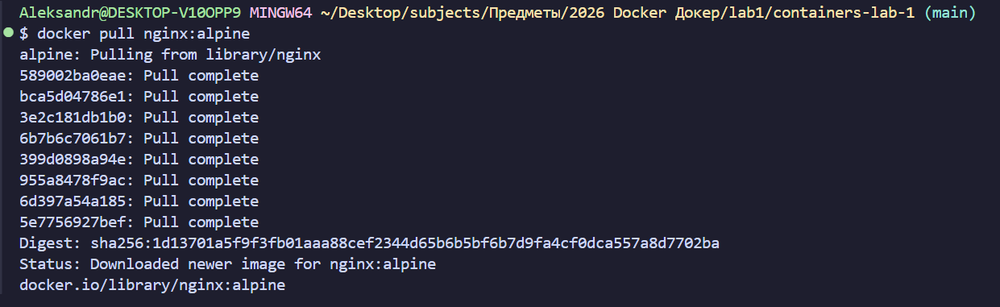

# Просмотр локальных образов
docker images

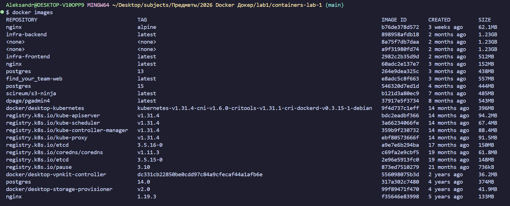

# Просмотр истории слоев образа
docker history nginx:alpine

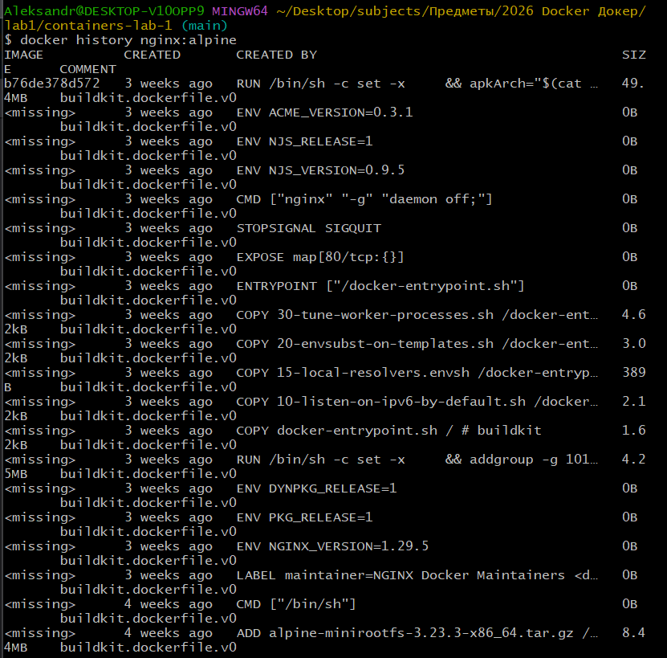

# Удаление образа
docker rmi nginx:alpine

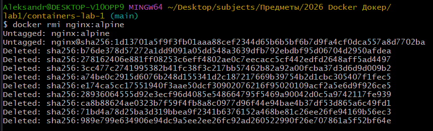

### Практическое задание: скачивание PostgreSQL 15 и Go 1.21
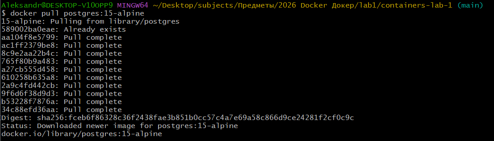
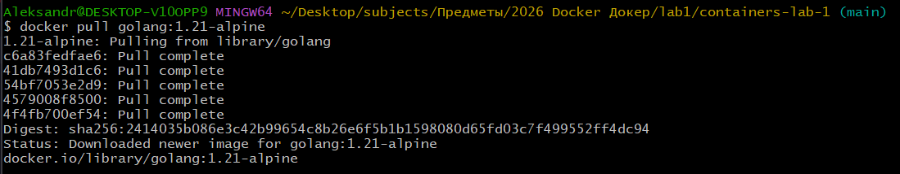

#### 1.2 Работа с контейнерами

# Запуск контейнера alpine в интерактивном режиме (при отсутствии образа на
# компьютере при выполнении этой команды должен загрузить автоматически!)
docker run -it --name test-alpine alpine:latest sh

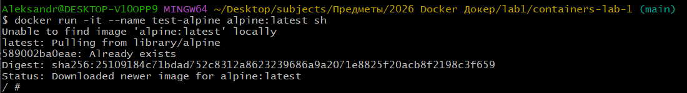

# Внутри контейнера выполните: ls -la, exit. Должно отобразиться содержимое
# корневой папки контейнера alpine, затем exit выводит нас из интерактивного режима
# shell контейнера.

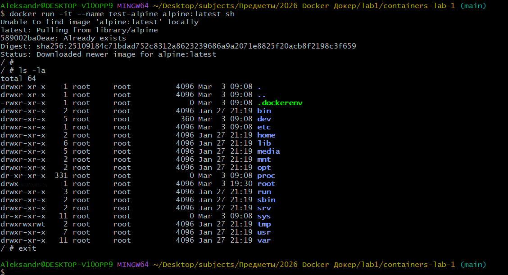

# Запуск контейнера в фоновом режиме
docker run -d --name web-server -p 8080:80 nginx:alpine

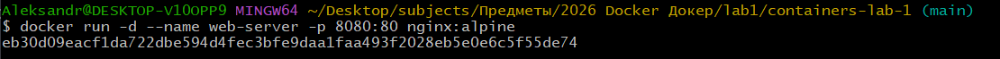

# Просмотр запущенных контейнеров
docker ps

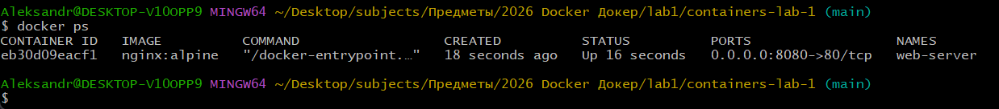

# Просмотр всех контейнеров (включая остановленные)
docker ps -a

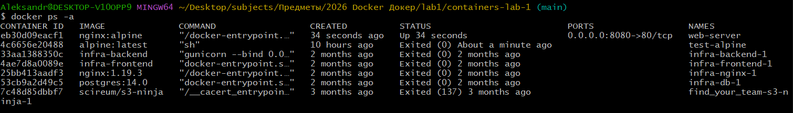

# Просмотр логов контейнера
docker logs web-server

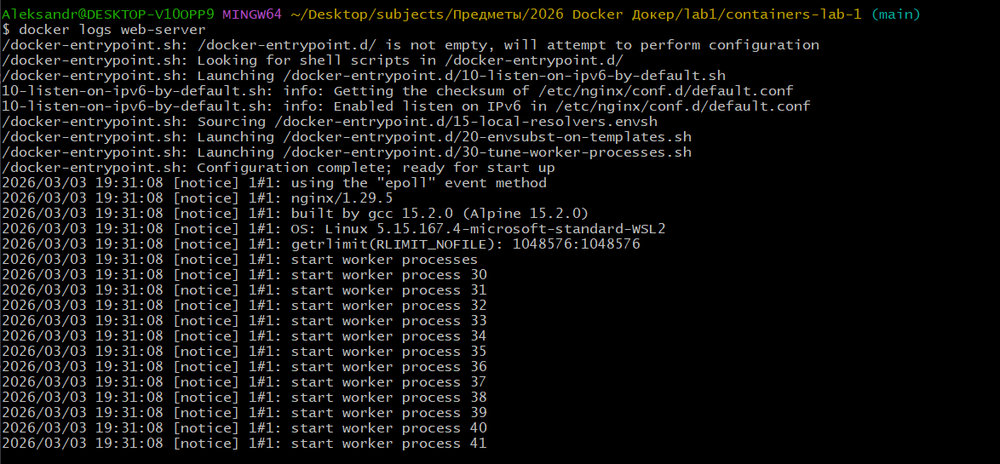

# Подключение к работающему контейнеру
docker exec -it web-server sh

# Внутри контейнера выполните: cat /usr/share/nginx/html/index.html, exit

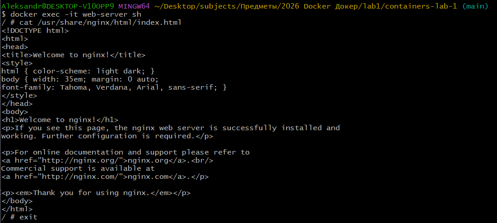

# Остановка контейнера
docker stop web-server

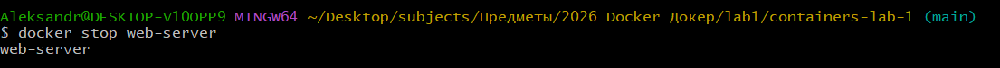

# Запуск остановленного контейнера
docker start web-server

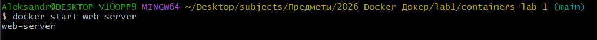

# Удаление контейнера
docker rm web-server # предварительно остановите

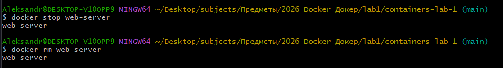

### Практическое задание

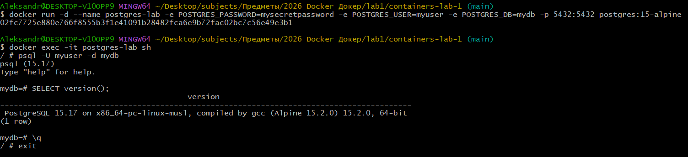

#### 1.3 Работа с томами

##### Задание 2.3.1: Сохраните данные вне контейнера

# Создание именованного тома
docker volume create my-app-data

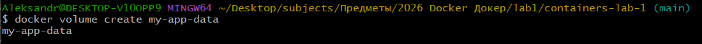

# Просмотр томов
docker volume ls

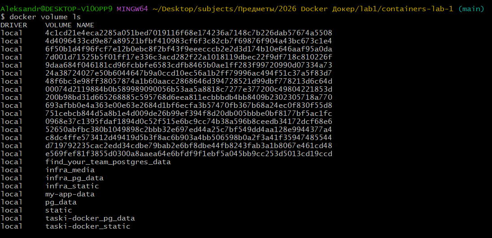

# Информация о томе
docker volume inspect my-app-data

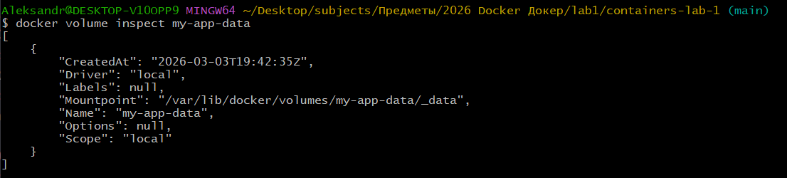

# Запуск контейнера с томом
docker run -d \
--name postgres-db \
-e POSTGRES_PASSWORD=secret \
-e POSTGRES_DB=testdb \
-v my-app-data:/var/lib/postgresql/data \
-p 5432:5432 \
postgres:15-alpine

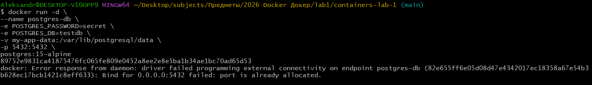

# Создание тестовой таблицы
docker exec -it postgres-db psql -U postgres -d testdb -c "CREATE TABLE users (id
SERIAL, name TEXT);"

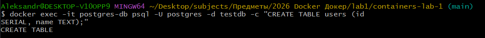

docker exec -it postgres-db psql -U postgres -d testdb -c "INSERT INTO users
(name) VALUES ('KAI-16');"

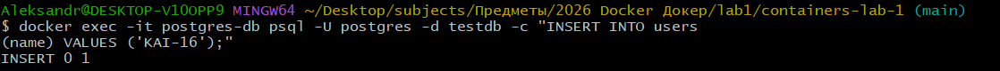

# Остановка и удаление контейнера (данные сохранятся в томе)
docker stop postgres-db
docker rm postgres-db

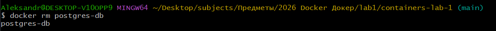

# Запуск нового контейнера с тем же томом
docker run -d \
--name new-postgres \
-e POSTGRES_PASSWORD=secret \
-e POSTGRES_DB=testdb \
-v my-app-data:/var/lib/postgresql/data \
-p 5432:5432 \
postgres:15-alpine

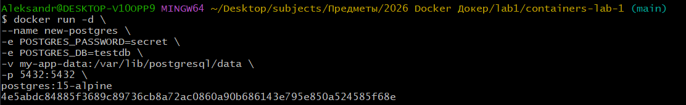

# Проверка, что данные сохранились
docker exec -it new-postgres psql -U postgres -d testdb -c "SELECT * FROM users;"

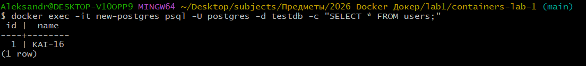

### Практическое задание:
# Практическое задание (выполнить самостоятельно!): Создайте том для статических файлов,
# запустите Nginx с примонтированным томом, скопируйте в него файл index.html с помощью docker
# cp по пути внутри контейнера /usr/share/nginx/html и проверьте доступность страницы в браузере.
# Также нужно подставить своё ФИО и группу в месте, гже это указано.

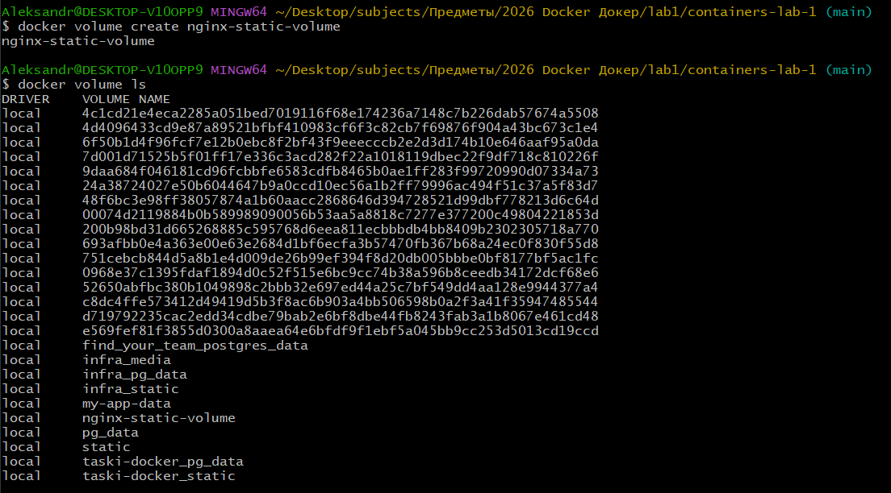
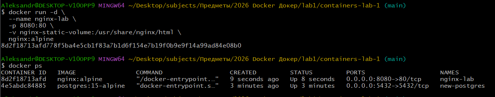
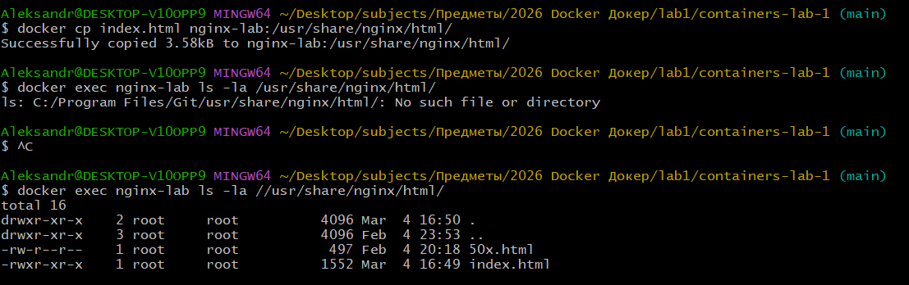

##### Проверка в браузере
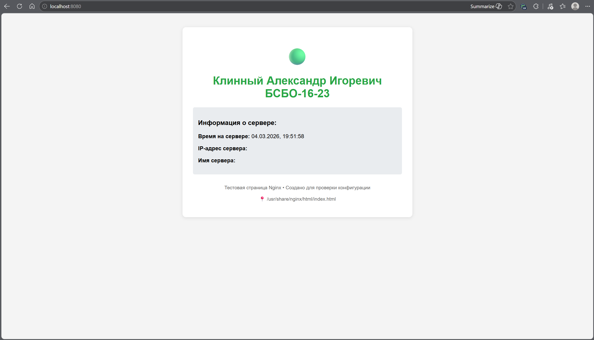

#### 1.4 Сеть в Docker

##### Задание 2.4.1: Создайте изолированную сеть для взаимодействия контейнеров

# Создание сети
docker network create my-app-network

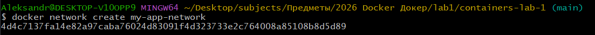

# Просмотр сетей
docker network ls

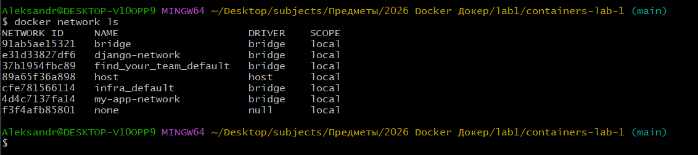

# Запуск контейнеров в одной сети
docker run -d \
--name postgres \
--network my-app-network \
-e POSTGRES_PASSWORD=secret \
-e POSTGRES_DB=myapp \
postgres:15-alpine
docker run -d \
--name app \
--network my-app-network \
-p 8080:80 \
nginx:alpine

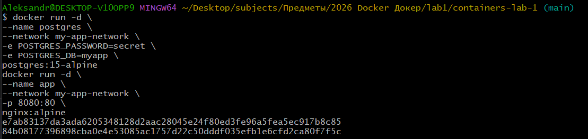

# Проверка связи между контейнерами
docker exec app ping postgres # должен быть ping

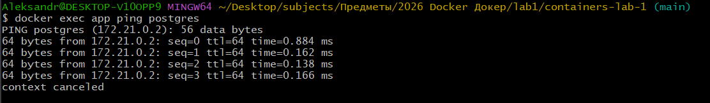

### Практическое задание
# Практическое задание (выполнить самостоятельно!): Создайте сеть типа bridge, запустите в ней два
# контейнера (Nginx и PostgreSQL), проверьте их взаимодействие по именам контейнеров (можно сделать
# ping из контейнера к другому контейнеру через docker exec). Отразить вывод в отчет.

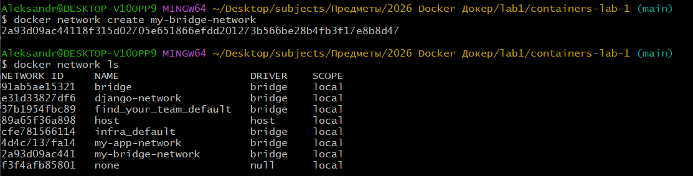
# Создание контейнеров
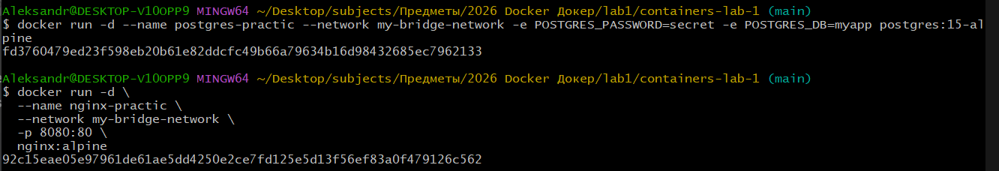

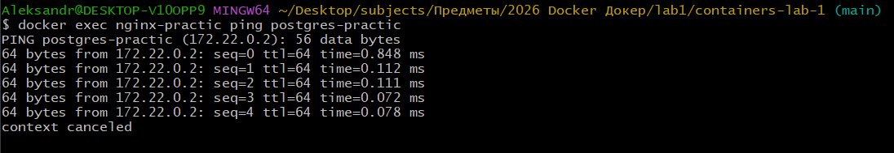

###### Часть 2. Разработка многокомпонентного приложения
##### 2.1 Backend на Go
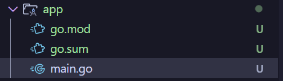
##### 2.2 Frontend и статика
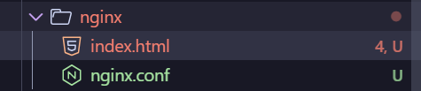
##### 2.3 Скрипты инициализации БД
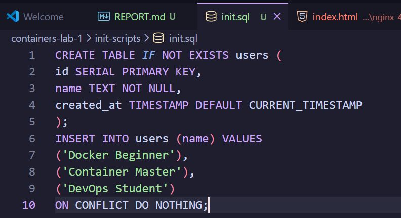

###### Часть 3. Multi-stage сборка Docker-образов
##### 3.1 Dockerfile для Go приложения
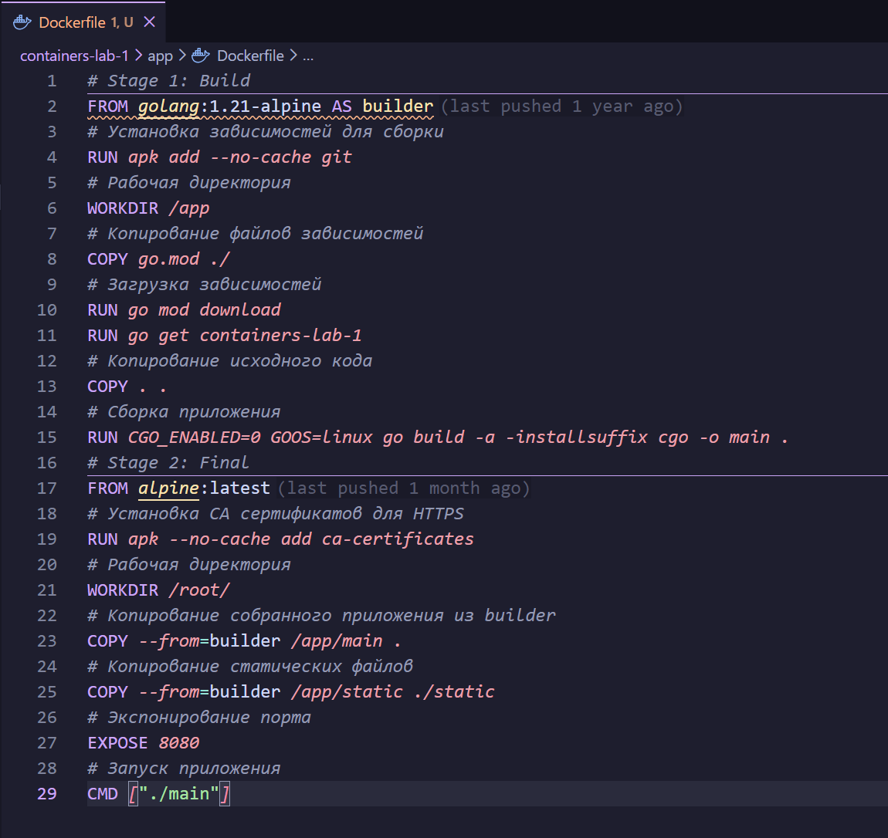
##### 3.2 Docker-compose для локальной разработки

###### Часть 4. GitHub Actions для автоматизации
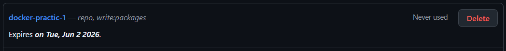

#### 4.2 Настройка Secrets в репозитории
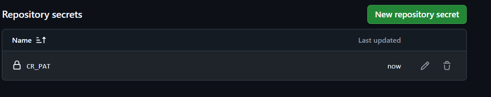

#### 4.3 Создание GitHub Actions workflow
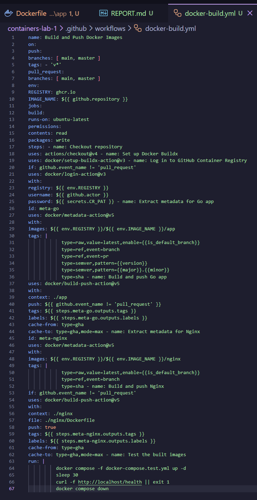

# * ВАЖНО! Для корректной сборки в Github Actions также необходимо создать файл
# ./nginx/Dockerfile, и спомощью команд COPY поместить во внутрь образа файлы index.html и
# nginx.conf

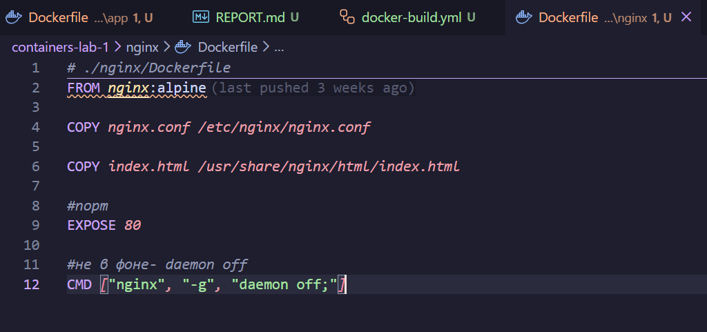

#### 4.4 Тестовый docker-compose для CI
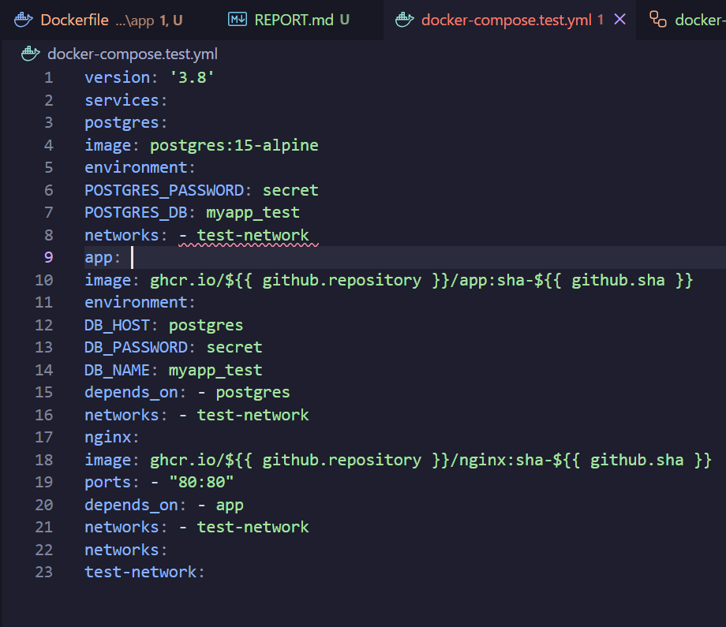

###### Часть 5. Скриншоты работающего приложения
### Главная страница 

### Добавление пользователя 

### Список пользователей в БД 

#### 4.5 GitHub Actions 

#### 4.6 Успешный запуск workflow 

#### 4.7 Опубликованные образы в GHCR 

###### Выводы 
[Опишите, что нового узнали, с какими трудностями столкнулись]