# Отчет по практической работе №1
## Студент: KAI
## Группа: 16
## Дата выполнения: 30.03.2026

### 1. Подготовка к Лабораторной

## 1. Установка kubectl

## 2. Установка Minikube

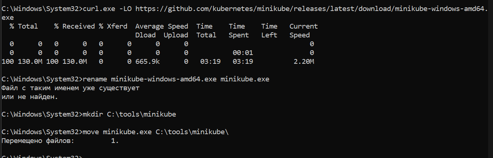

## Добавление в PATH

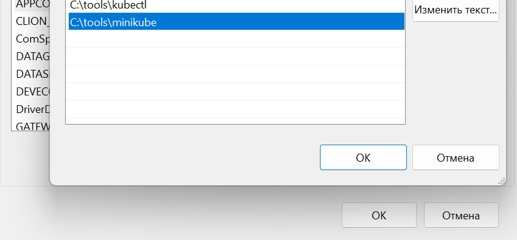

## Запуск Minikube с драйвером Docker

## Настройка доступа к GHCR

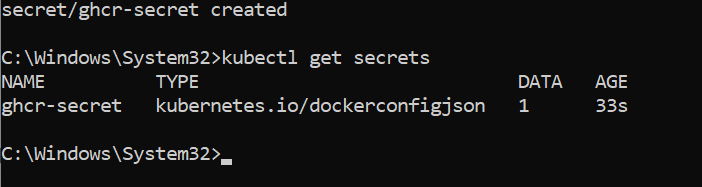

## Подготовка репозитория

### Часть 2. Знакомство с kubectl и базовыми концепциями

## 2.1 Первые команды kubectl

Задание 2.1.1: Исследуйте кластер

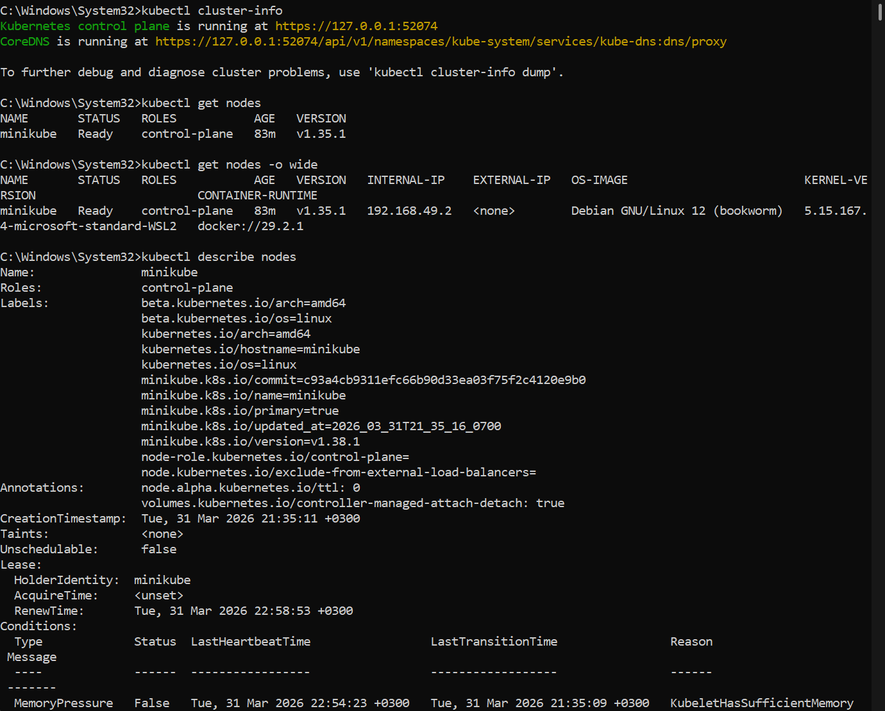

Самостоятельное задание

NAME       STATUS   ROLES           AGE   VERSION   INTERNAL-IP    EXTERNAL-IP   OS-IMAGE                         KERNEL-VERSION                       CONTAINER-RUNTIME
minikube   Ready    control-plane   86m   v1.35.1   192.168.49.2   <none>        Debian GNU/Linux 12 (bookworm)   5.15.167.4-microsoft-standard-WSL2   docker://29.2.1

2.2 Работа с подами (Pods)

Logs

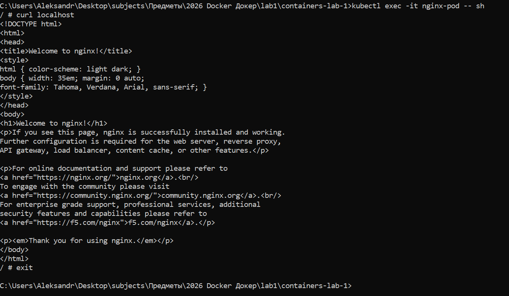

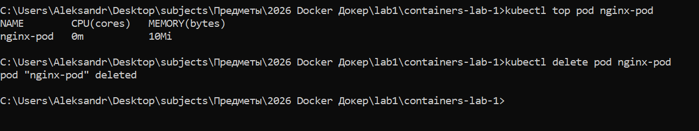

Самостоятельное задание

2026/03/31 20:14:24 Error creating table:dial tcp [::1]:5432: connect: connection refused

## 2.3 Работа с ReplicaSet

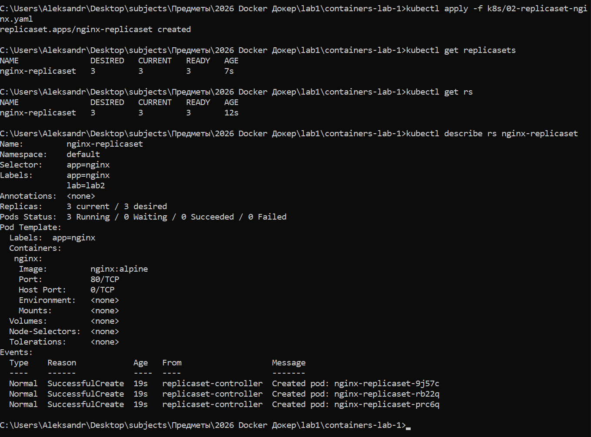

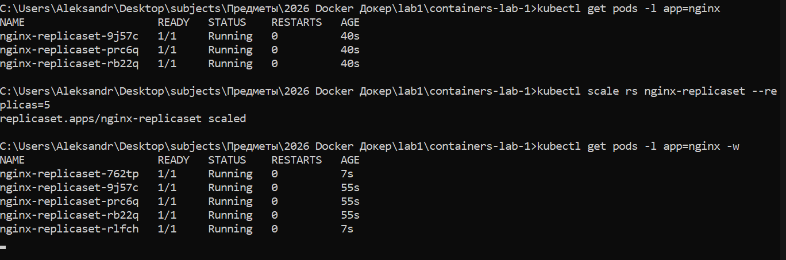

## 2.4 Работа с Deployment

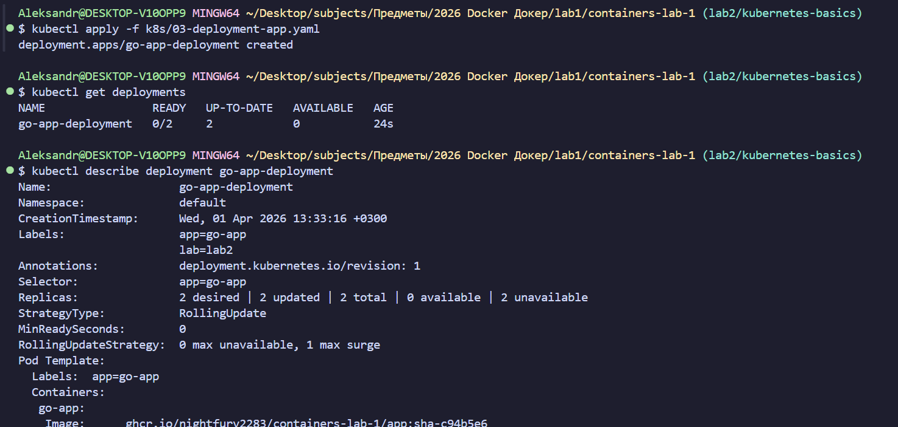

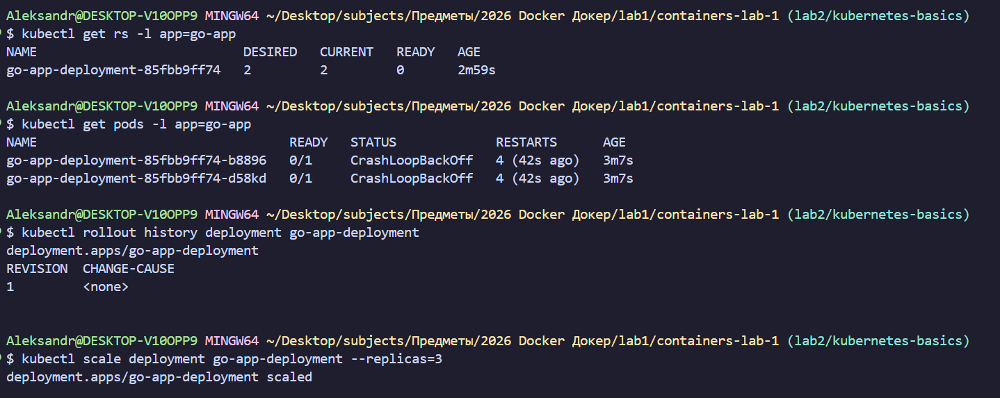

### Самостоятельное задание:

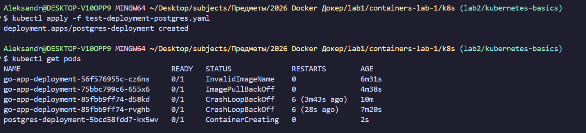

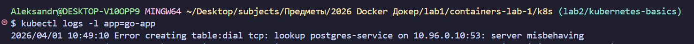

### 2.5 Работа с Service

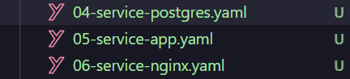

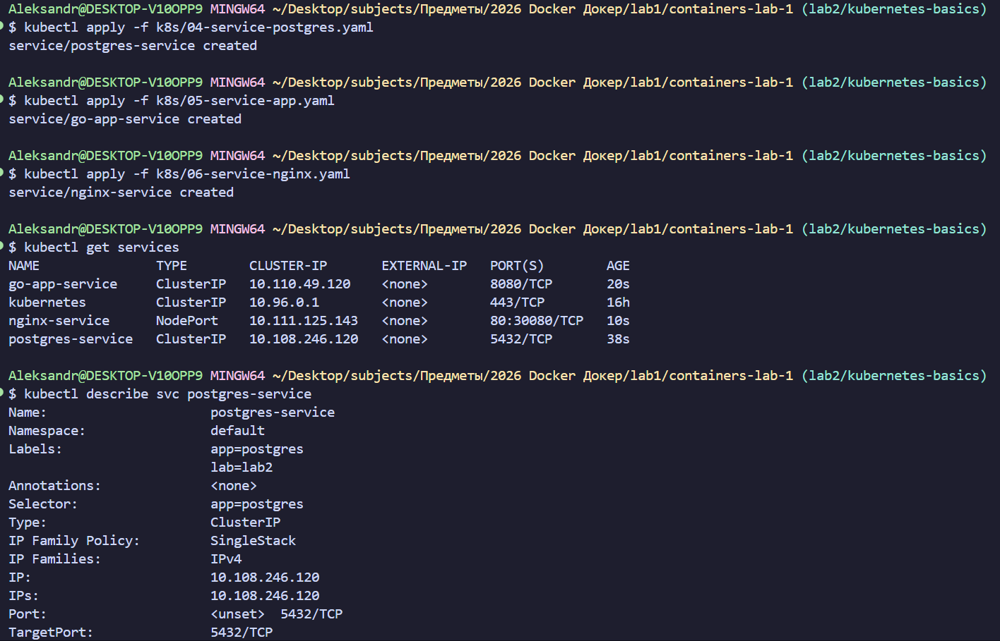

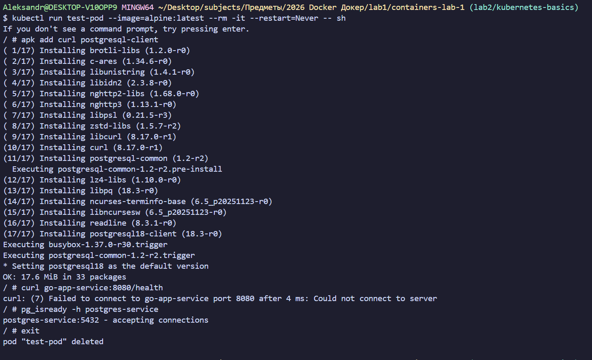

## 2.6 Полный стек приложения

### Часть 3. Валидация и отладка манифестов
## 3.1 Валидация YAML

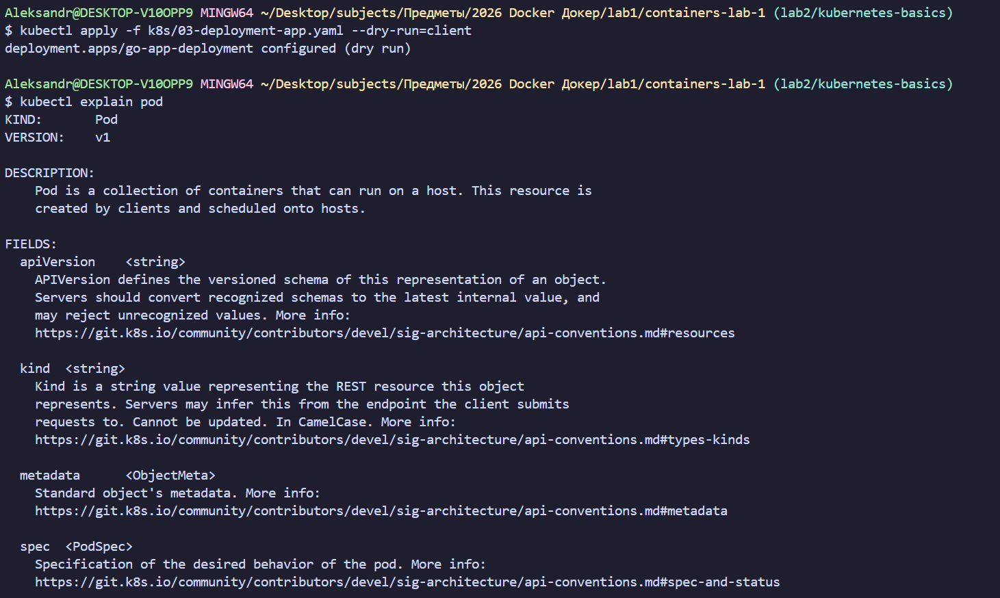

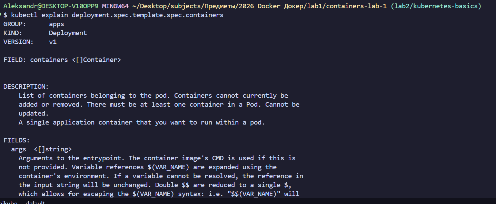

## 3.2 Отладка приложений

## 3.3 Мониторинг через Dashboard

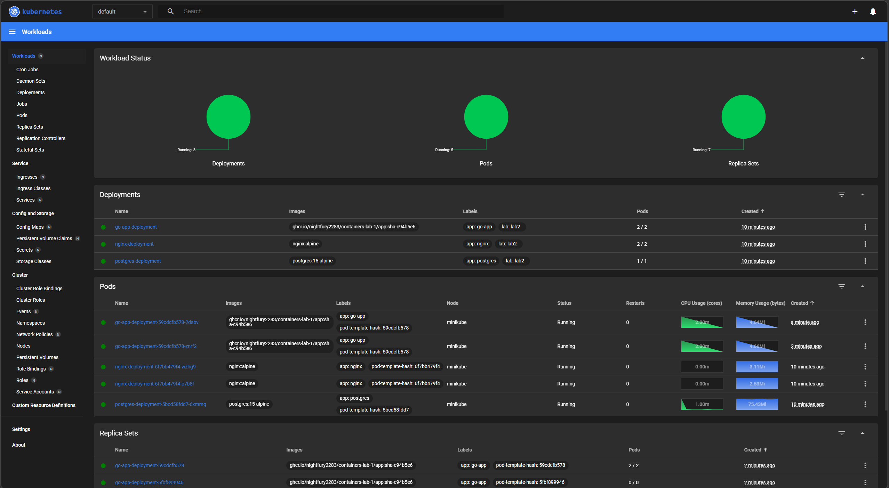

### Часть 4. GitHub Actions для проверки манифестов

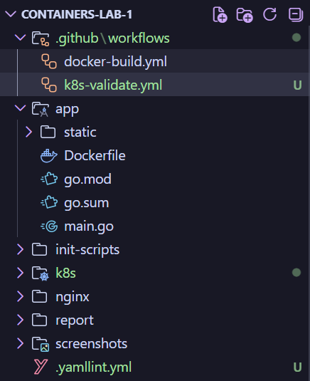

### Часть 5. Финальный запуск и проверка

