# Отчет по практической работе №2
## Студент: KAI
## Группа: 16
## Дата выполнения: 30.03.2026

### 1. Подготовка к Лабораторной

#### 1.1 Установка kubectl
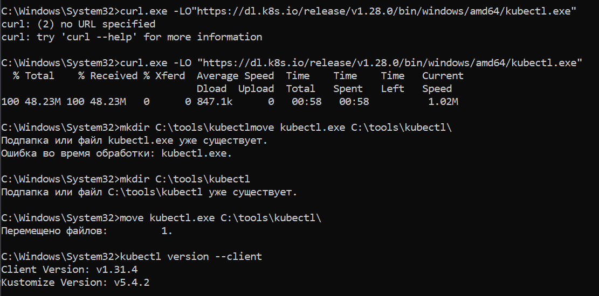

#### 1.2 Установка Minikube


#### 1.3 Добавление в PATH


#### 1.4 Запуск Minikube с драйвером Docker
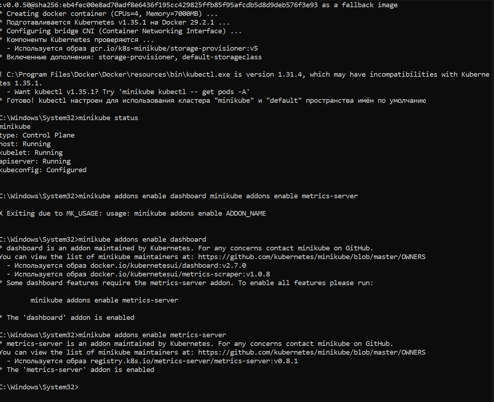
```bash
minikube status
type: Control Plane
host: Running
kubelet: Running
apiserver: Running
kubeconfig: Configured
```

#### 1.5 Настройка доступа к GHCR


#### 1.6 Подготовка репозитория
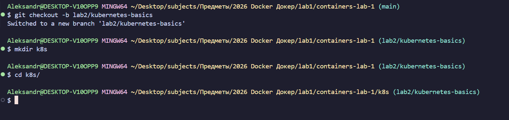

---

### Часть 2. Знакомство с kubectl и базовыми концепциями

#### 2.1 Первые команды kubectl
Задание 2.1.1: Исследуйте кластер

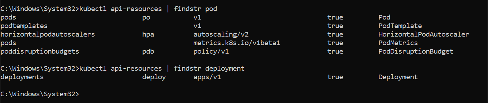
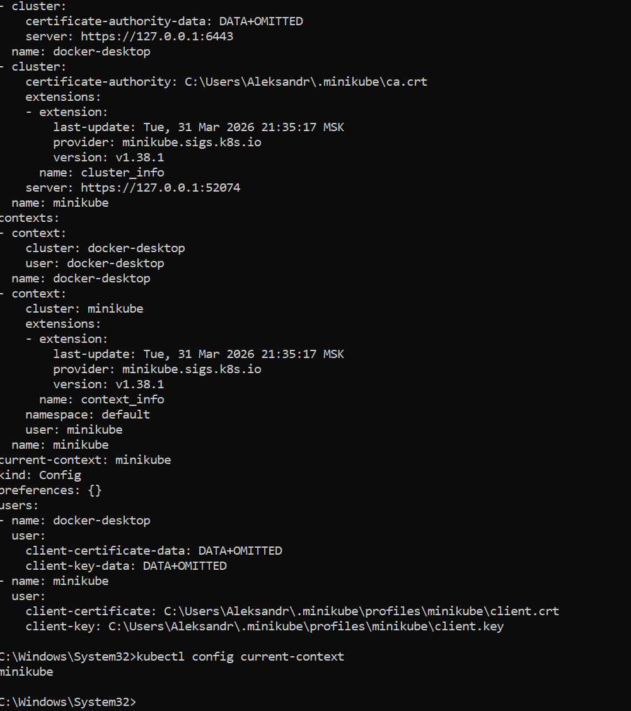

Самостоятельное задание (nodes.txt):
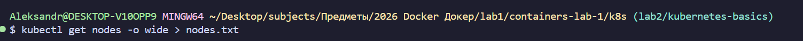
```text
NAME       STATUS   ROLES           AGE   VERSION   INTERNAL-IP    EXTERNAL-IP   OS-IMAGE                         KERNEL-VERSION                       CONTAINER-RUNTIME
minikube   Ready    control-plane   22h   v1.35.1   192.168.49.2   <none>        Debian GNU/Linux 12 (bookworm)   5.15.167.4-microsoft-standard-WSL2   docker://29.2.1
```

#### 2.2 Работа с подами (Pods)
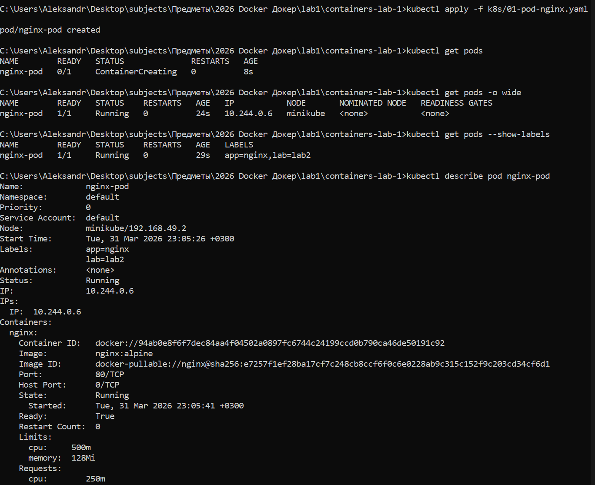
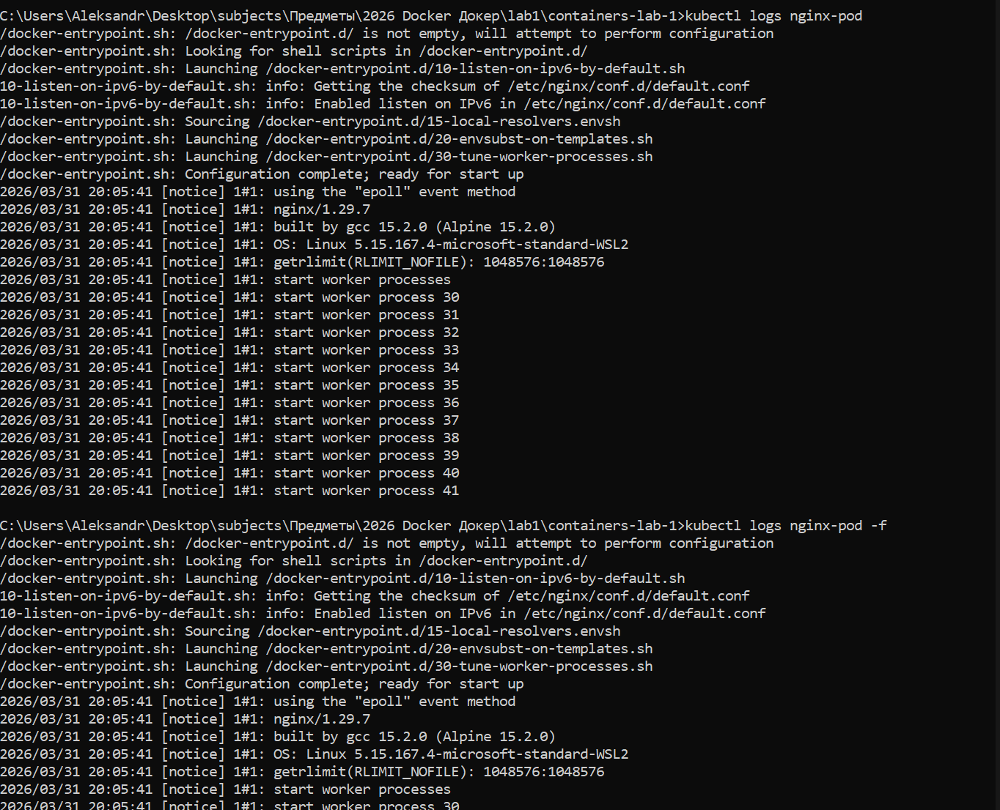


Самостоятельное задание (Go-приложение из ЛР1):
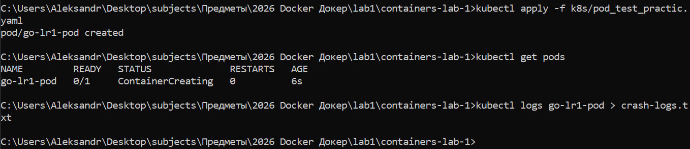
```text
2026/03/31 20:14:24 Error creating table:dial tcp [::1]:5432: connect: connection refused
```

#### 2.3 Работа с ReplicaSet


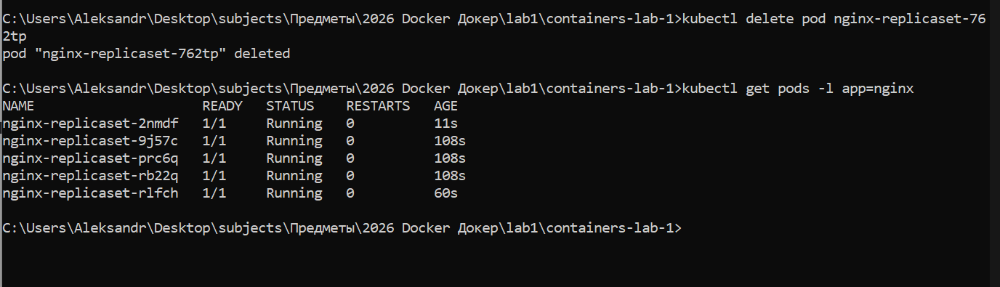

#### 2.4 Работа с Deployment


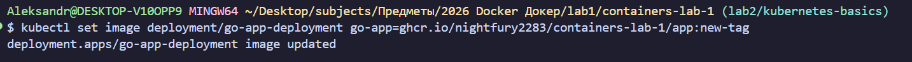

Самостоятельное задание (PostgreSQL Deployment):


#### 2.5 Работа с Service


#### 2.6 Полный стек приложения
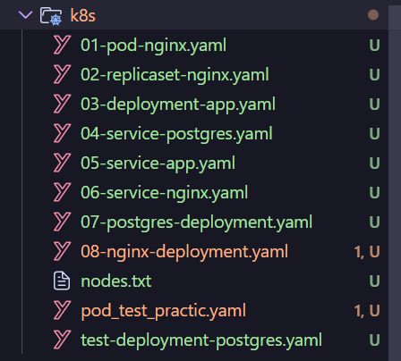

---

### Часть 3. Валидация и отладка манифестов

#### 3.1 Валидация YAML

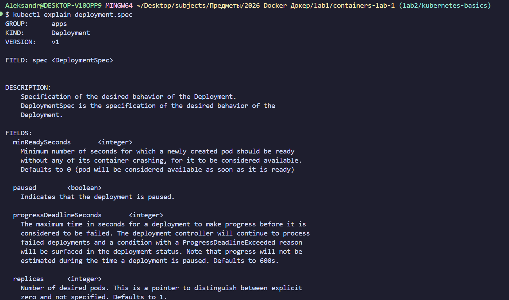


#### 3.2 Отладка приложений
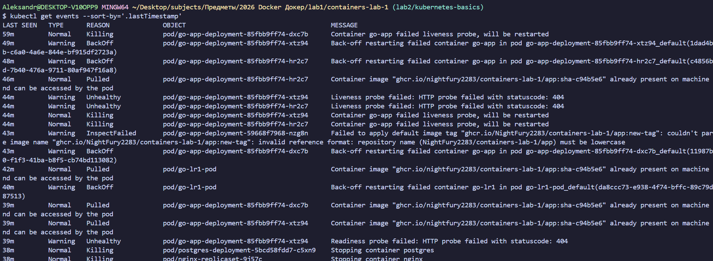
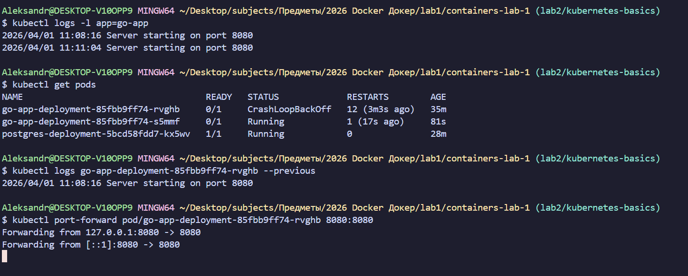
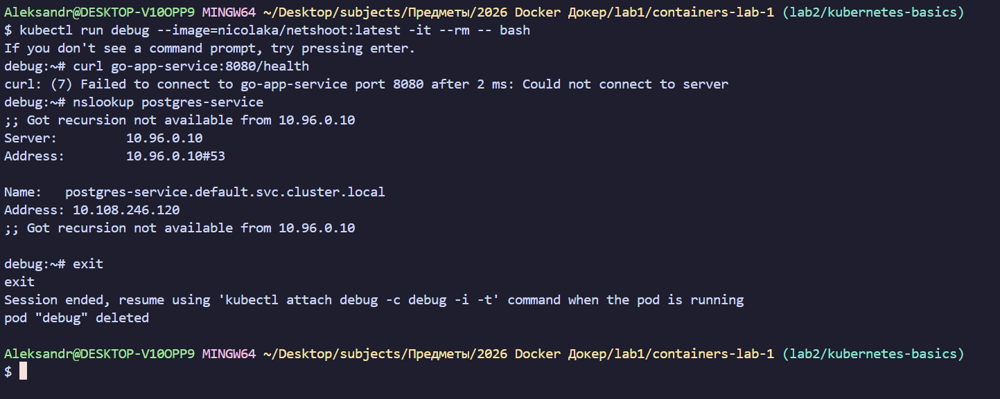

#### 3.3 Мониторинг через Dashboard


---

### Часть 4. GitHub Actions для проверки манифестов


---

### Часть 5. Финальный запуск и проверка

#### 5.1 Главная страница приложения
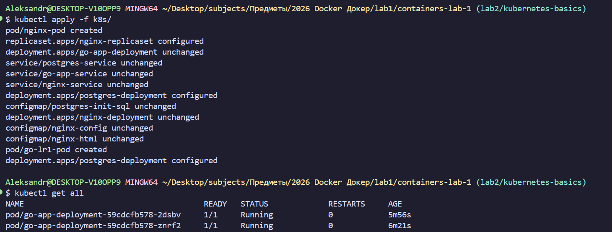

#### 5.2 Результат GET /api/users
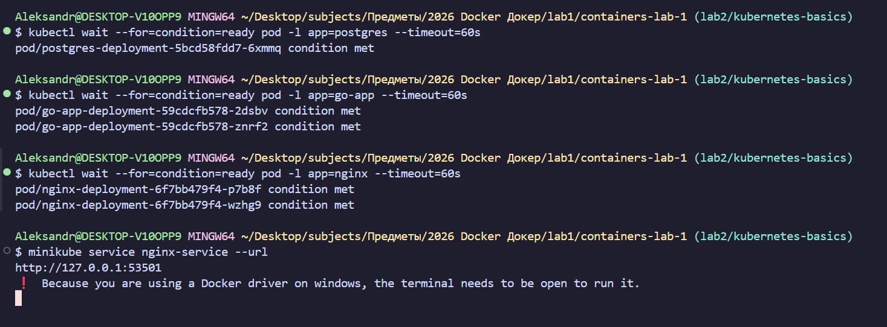

#### 5.3 GitHub Actions CI (Зеленая галочка)
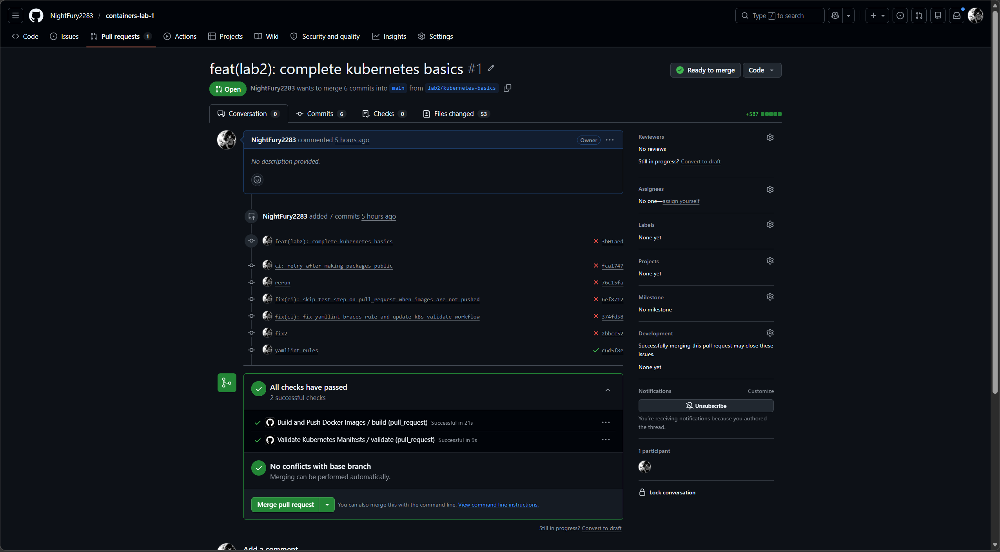

---

### Часть 6. Ответы на контрольные вопросы

1. **В чем разница между Pod и Deployment?**
   Pod — это минимальная единица развертывания в K8s (один или несколько контейнеров). Deployment — это контроллер более высокого уровня, который управляет ReplicaSet и обеспечивает стратегии обновления (RollingUpdate), отката и автоматического масштабирования.

2. **Для чего нужен Service типа ClusterIP?**
   Service типа ClusterIP предоставляет стабильный внутренний IP-адрес и DNS-имя группе подов внутри кластера. Он позволяет компонентам системы (например, бэкенду обращаться к БД) находить друг друга по имени сервиса, даже если поды пересоздаются и меняют свои внутренние IP.

3. **Как ReplicaSet обеспечивает самовосстановление?**
   ReplicaSet постоянно отслеживает текущее количество работающих подов и сравнивает его с заданным значением `replicas`. Если под падает или удаляется, ReplicaSet мгновенно создает новый на основе шаблона `PodTemplate`, чтобы поддерживать желаемое состояние.

4. **Что произойдет с приложением, если удалить под PostgreSQL?**
   Deployment автоматически перезапустит под PostgreSQL. Однако, так как в данной работе мы использовали `emptyDir` (временное хранилище), все данные в базе данных будут потеряны. Для сохранения данных в реальных проектах используются `PersistentVolumes`.

---

### Часть 7. Выводы
В ходе практической работы был успешно развернут локальный кластер Kubernetes с использованием Minikube. Освоены основные концепции оркестрации: управление жизненным циклом приложений через Deployment, балансировка нагрузки через Service и хранение конфигураций в ConfigMap. Была настроена автоматизированная валидация манифестов в GitHub Actions, что гарантирует корректность YAML-файлов перед деплоем. Самой интересной частью было решение проблем со статус-пробами (Readiness/Liveness probes) и настройка сетевого взаимодействия между Go-приложением и базой данных PostgreSQL.
